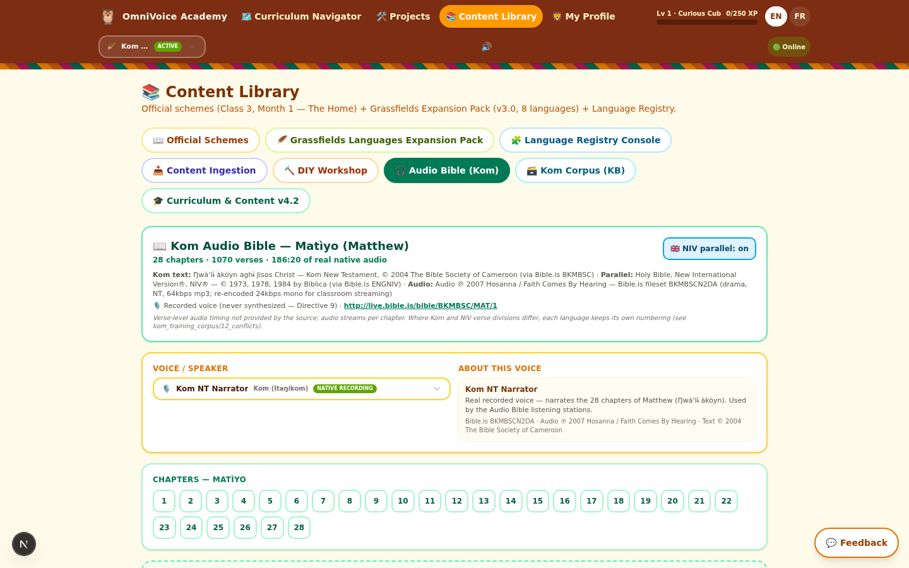
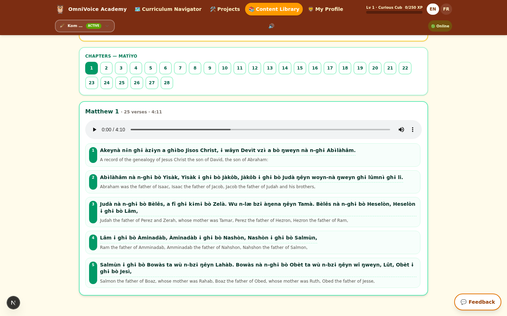
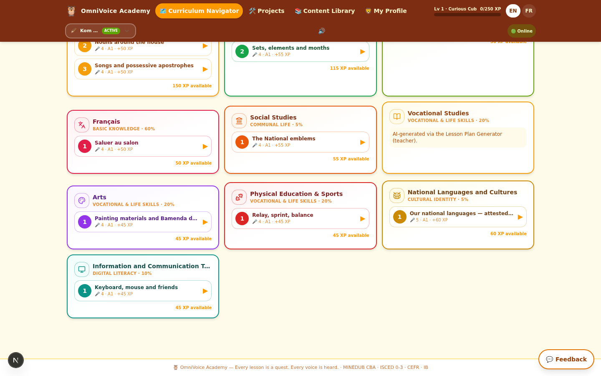
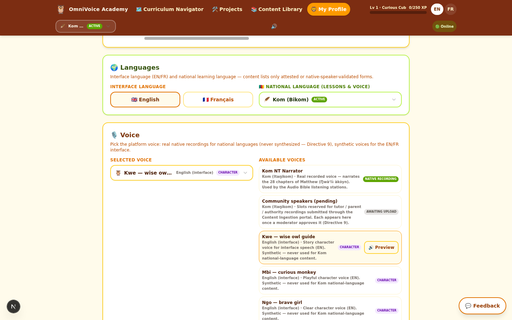
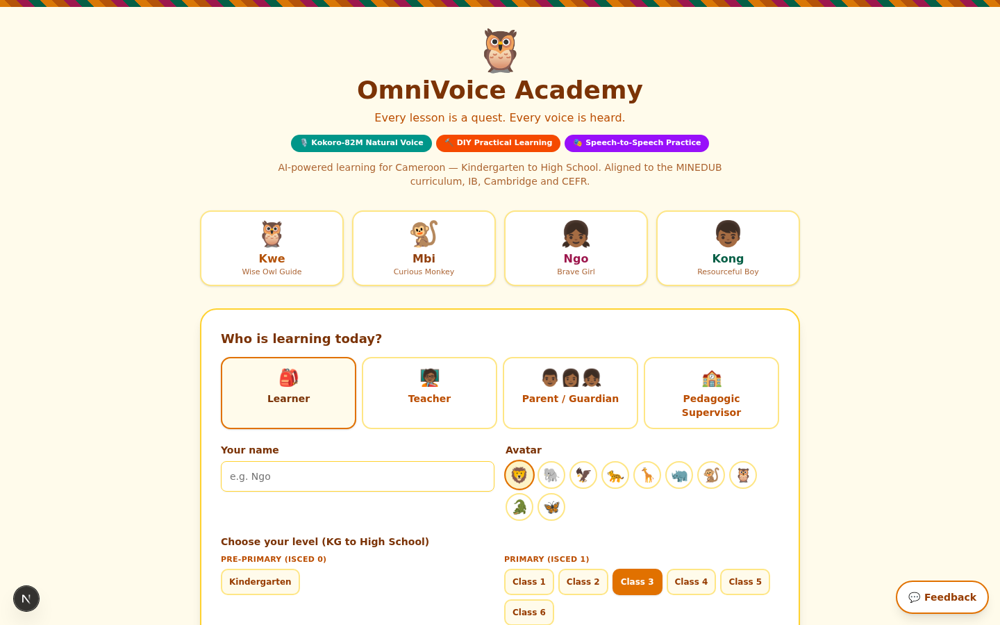
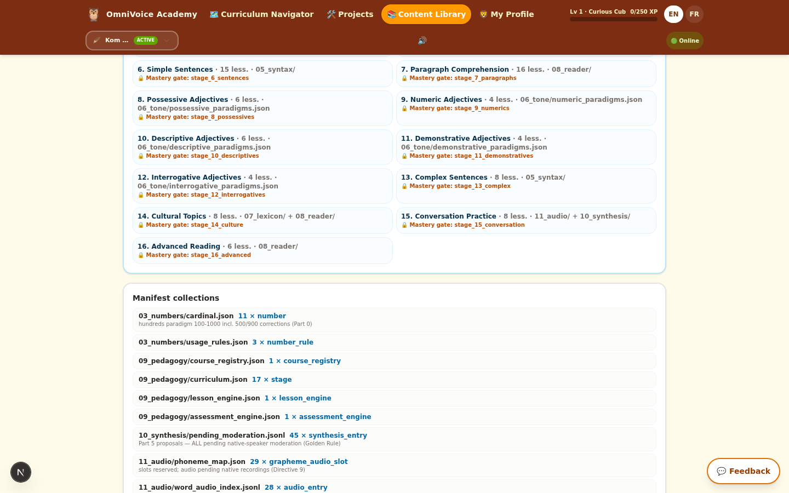
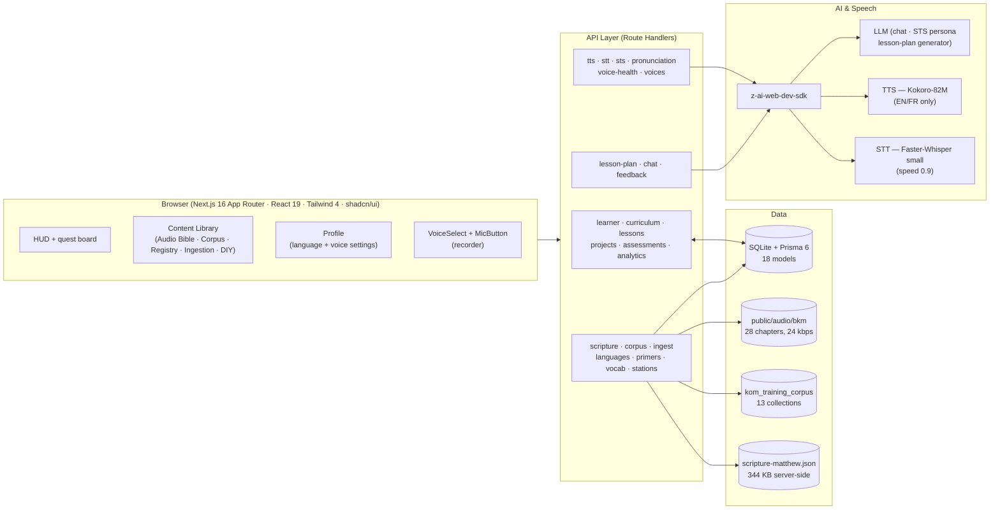

<div align="center">

# 🦉 OmniVoice Academy

### AI-Powered Primary Education for Cameroon — in the Child's Own Language

**Every lesson is a quest. Every voice is heard.**

[](https://nextjs.org)
[](https://react.dev)
[](https://www.typescriptlang.org)
[](https://www.prisma.io)
[](https://tailwindcss.com)
[](./LICENSE)

[](#-national-language-registry)
[](#-the-kom-audio-bible)
[](#design-principles)

</div>

---

**OmniVoice Academy** is a full-stack, voice-first learning platform that teaches the **Cameroon national primary curriculum** (MINEDUB, Competency-Based Approach) while building literacy **in the learner's own Grassfields language** — starting with **Kom (Itaŋikom)**. It pairs an AI tutor built on the official national schemes of work with *real* native-speaker audio, a tone-aware pronunciation coach, and a community ingestion pipeline that lets **tutors, parents and educational authorities** contribute verified language data directly to the platform.

> **Copyright note.** The Kom Bible text and audio in this repository are third-party copyrighted works used for educational access (see [Attribution](docs/ATTRIBUTION.md)); all rights remain with The Bible Society of Cameroon and Faith Comes By Hearing.

---

## 📸 What It Looks Like

| Kom Audio Bible — Matthew | Chapter player (Kom + NIV) |
|---|---|
|  |  |

| Curriculum Navigator (Kom active) | Voice picker (Directive 9 grouping) |
|---|---|
|  |  |

| Landing — choose learner, level, language | Kom Corpus Knowledge Base |
|---|---|
|  |  |

---

## 📋 Table of Contents

1. [Why OmniVoice](#-why-omnivoice)
2. [Feature Highlights](#-feature-highlights)
3. [National Language Registry](#-national-language-registry)
4. [The Kom Audio Bible](#-the-kom-audio-bible)
5. [Voice & Speaker Selection](#-voice--speaker-selection)
6. [Content Integrity & Directive 9](#-content-integrity--directive-9)
7. [Architecture](#-architecture)
8. [Tech Stack](#-tech-stack)
9. [Project Structure](#-project-structure)
10. [Getting Started](#-getting-started)
11. [API Overview](#-api-overview)
12. [Documentation Index](#-documentation-index)
13. [Testing & Quality Assurance](#-testing--quality-assurance)
14. [Roadmap](#-roadmap)
15. [Contributing](#-contributing)
16. [Attribution & License](#-attribution--license)

---

## 🌍 Why OmniVoice

Across Cameroon's North-West Region, millions of children begin school in a language they do not speak at home. Early-grade literacy suffers when the medium of instruction is foreign, yet the region's Grassfields languages — Kom, Lamnso', Bafut, Oku, Babanki, Mankon, Ngie — are richly tonal, under-documented online, and almost absent from educational technology. Meanwhile, teachers operate under the national Competency-Based Approach (CBA) with limited tools for the "Inclusive Language Teaching" (ILT) hours that connect national languages to classroom practice.

OmniVoice Academy attacks this problem on three fronts at once. First, it digitises the **official curriculum** — the National Curriculum Level I (2018), the Regional Monthly Integrated Learning Plan Level II (Littoral), and Level III — into a gamified quest board spanning 14 school stages from Kindergarten to Upper Sixth, with subject weightings that mirror the national 60/5/20/5/10 domain split. Second, it builds **first-language literacy** through tone-aware teaching of Grassfields languages, using the General Alphabet of Cameroonian Languages (GACL, 1979) orthography and linguist-attested content. Third, it treats **voice as the primary interface**: children who cannot yet read can still listen, speak, and be understood, through speech-to-text practice, text-to-speech storytelling, and speech-to-speech conversation with in-character AI tutors.

The platform is deliberately engineered for its operating environment — rural Cameroonian classrooms and homes — with low-bandwidth audio (24 kbps mono chapters), offline-capable lesson cards, and a DIY (Do-It-Yourself) lesson model that pairs every 5–10 minute digital activity with a 15–30 minute hands-on activity that works with no electricity at all.

---

## ✨ Feature Highlights

### 🎧 The Kom Audio Bible
A complete, locally-hosted listening station for the **Gospel of Matthew in Kom (Itaŋikom)** — 28 chapters, **1,070 verse rows** of Kom text paired with the **New International Version (NIV)** in English, and **186 minutes 20 seconds of real native-speaker narration** (never synthesized). Chapters stream from `public/audio/bkm/matthew/` at 24 kbps mono for classroom bandwidth, with a 10-second sample clip used for instant voice previews. Verse-level Kom/NIV pairing is done by verse number without force-merging the two translations' differing verse divisions.

### 🗣️ Voice & Speaker Selection
A platform-wide voice registry exposes every available voice from a single picker: the real **Kom NT Narrator** (native recording), reserved slots for **community recordings** awaiting moderator approval, four **Kokoro story characters** (Kwe the owl, Mbi the monkey, Ngo, Kong) for English interface speech, and a **French narrator**. The selected voice travels through every spoken interaction — lesson hooks, celebrations, pronunciation drills — and the TTS API **server-side refuses** any request asking a synthetic engine to speak a Grassfields language.

### 📚 Full Curriculum Engine
The official Class 3 Month 1 schemes for all nine subjects (English, Mathematics, Science & Technology, Français, Social Studies, Vocational Studies, Arts, Physical Education, ICT) plus National Languages & Culture, keyed to weekly ILTs, with terminal outcomes per subject for Levels I–III, an ISCED 0–3 stage ladder (KG → Upper Sixth), XP/badge/skill-tree progression (31 badges), and project-based learning with three-phase projects.

### ✍️ KomToneEngine
Kom is a three-tone language (High, Low, Falling) with documented tone-spreading rules. The engine tokenizes tone-bearing units, applies **HTS (High Tone Spreading)** and **LTS (L Tone Spreading)** per Hyman's analysis, and scores learner pronunciation with a 40/60 tone-vs-segmental weighting — so a child can be coached on *the melody of the word*, not just its consonants.

### 📥 Community Ingestion Pipeline
Tutors, parents and educational authorities submit words, greetings, dialogues, songs, stories and corrections through a dedicated portal. Every submission **must cite its source** and pass a native-speaker confirmation gate before it can be activated. Submissions move through a transparent review workflow: `DRAFT → IN_REVIEW → ACTIVE | REJECTED`, with contributor credit shown on published content.

### 🗃️ Kom Corpus Knowledge Base
A structured training corpus (`kom_training_corpus/`) covering alphabet, phonology, numerals, tone paradigms, pedagogy (a 16-stage mastery-gated course), synthesis proposals awaiting native moderation, a real-audio index, documented conflicts, and agent expansion protocols — browsable in-app and consumable by downstream AI pipelines.

### 🧩 Language Registry Console
New languages can be **registered live** (name, ISO code, region, phase) and instantly propagate to every picker in the platform — HUD, landing, profile, teacher view, and library. Every language's status (ACTIVE / PLANNED / DRAFT) is honest and visible, and undocumented content shows "awaiting native-speaker documentation" instead of fabricated phrases.

---

## 🌐 National Language Registry

The platform's national-language dropdown (in the HUD, landing page, profile and teacher studio) lists every registered language **with an honest status chip**. Content availability is decoupled from listing: a PLANNED language appears in the menu and routes learners to documentation resources rather than fabricated content.

| Language | Native name | ISO 639-3 | Family | Region | Speakers | Status |
|---|---|---|---|---|---|---|
| **Kom (Bikom)** | Itaŋikom | `bkm` | Narrow Bantu → Central Ring (Grassfields) | North-West — Boyo Division | ~233,000 (2005) | 🟢 **ACTIVE** — flagship |
| **Lamnso' (Lamso)** | Lamnso' | `lns` | Narrow Bantu → Ring (Grassfields) | North-West — Nso Division | ~125,000 (1987) | 🟢 **ACTIVE** |
| **Bayangi (Banyangi)** | Banyangi | `byv` | Narrow Bantu → Momo (Grassfields) | South-West / North-West | — | 🟡 **ACTIVE (placeholder)** — data ingestion in progress |
| **Ewondo** | Ewondo | `ewo` | Narrow Bantu → Beti (Fang) — *not Grassfields* | Centre / South | — | ⚪ **PLANNED** — no voice pipeline coverage yet |
| **Bafut** | Bafut | `bfd` | Narrow Bantu → Mbam-Nkam (Grassfields) | North-West — Mezam Division | ~105,000 | ⚪ **PLANNED** |
| **Oku** | Oku (Ebkuo) | `oku` | Narrow Bantu → Ring (Grassfields) | North-West — Bui Division | ~40,000 | ⚪ **PLANNED** |
| **Babanki** | Kejom | `bbk` | Narrow Bantu → Ring (Grassfields) | North-West — Mezam Division | ~25,000 | ⚪ **PLANNED** |
| **Mankon** | Mankon | `mgo` | Narrow Bantu → Mbam-Nkam (Grassfields) | North-West — Mezam Division | ~80,000 | ⚪ **PLANNED** |
| **Ngie** | Ngie (Ngoshie) | `ngi` | Narrow Bantu → Momo (Grassfields) | North-West — Momo Division | ~40,000 | ⚪ **PLANNED** |

Community drafts (e.g. *Duala*, *Yambassa*) appear in the dropdown the moment a supervisor registers them in the **Language Registry Console**, before any content exists.

Interface languages: **English 🇬🇧** and **Français 🇫🇷** (fully translated UI, 100+ strings).

---

## 🎧 The Kom Audio Bible

| | |
|---|---|
| **Book** | Matìyo (Matthew), complete — 28 chapters |
| **Kom text** | Ŋwàʼlɨ̀ àkòyn ghɨ Jisos Christ — Kom New Testament, © 2004 The Bible Society of Cameroon (via Bible.is `BKMBSC`) |
| **Parallel text** | Holy Bible, New International Version®, NIV®, © 1973, 1978, 1984, 2011 by Biblica (via Bible.is `ENGNIV`) |
| **Audio** | ℗ 2007 Hosanna / Faith Comes By Hearing — Bible.is fileset `BKMBSCN2DA` (drama, 64 kbps MP3), re-encoded to **24 kbps mono 22.05 kHz** |
| **Narration** | Real native-speaker recording — **never synthesized** (Directive 9) |
| **Duration** | 186 min 20 s across 28 chapters |
| **Storage** | `public/audio/bkm/matthew/mat_NN_kom_24k.mp3` + `mat_01_sample_10s.mp3` preview |
| **Serving** | `GET /api/scripture` (chapter index & verse payloads), ScripturePlayer UI in the Content Library |

The scraping, normalization and ingestion pipeline (harvested from Bible.is with source metadata preserved, re-encoded with ffmpeg, aligned by verse number, verse-division conflicts documented rather than merged) is described in [docs/CORPUS.md](docs/CORPUS.md).

---

## 🎙️ Voice & Speaker Selection

Voices are defined in one registry (`src/lib/data/voices.ts`) and exposed through the profile voice section, the Audio Bible station, and `GET /api/voices`:

| Voice ID | Name | Kind | Directive 9 status |
|---|---|---|---|
| `bkm_nt_narrator` | Kom NT Narrator | `recorded` | ✅ Real recording — narrates all 28 Matthew chapters; previews play a real 10 s clip |
| `bkm_community_recordings` | Community speakers (pending) | `recorded` | ⏳ Slots reserved for tutor/parent/authority uploads via the Ingestion Portal |
| `voice_kwe` | Kwe — wise owl guide | `persona` | 🔒 English interface only — synthetic |
| `voice_mbi` | Mbi — curious monkey | `persona` | 🔒 English interface only — synthetic |
| `voice_ngo` | Ngo — brave girl | `persona` | 🔒 English interface only — synthetic |
| `voice_kong` | Kong — resourceful boy | `persona` | 🔒 English interface only — synthetic |
| `voice_ff_siwis` | French narrator (Siwis) | `tts` | 🔒 French interface only — synthetic |

The picker groups voices by kind and disables anything awaiting upload. `POST /api/tts` resolves platform voice IDs and **hard-refuses** (`recordedOnly` response) any attempt to synthesize a recorded voice — the guarantee is enforced server-side, not just in the UI.

---

## 🔒 Content Integrity & Directive 9

**Directive 9 — the platform's prime content law:** *No Grassfields-language speech may be synthesized. National-language audio must come from real native speakers.* This exists because a classroom's first exposure to a heritage language must be authentic human speech, and because tone errors from generic TTS engines would teach children wrong.

Enforcement in code:

- `POST /api/tts` rejects synthesis for recorded voices and for Grassfields-language text (returns `recordedOnly`).
- Synthetic (Kokoro) voices are restricted to the English/French **interface** layer.
- The voice registry labels every voice's coverage; the UI disables synthetic voices for national-language content.
- The corpus reserves phoneme/audio slots for native recordings (`kom_training_corpus/11_audio/phoneme_map.json` — 29 slots, `audioStatus: PENDING_NATIVE_RECORDING`).

**Trusted-sources-only content policy.** Every Kom phrase shown to learners must be attested in a whitelisted source — anything else displays *"to be documented with native speakers"* and links to the Ingestion Portal. Platform-invented placeholder content has been **purged** (greetings, dialogues, celebration strings). Current whitelisted sources:

1. **Hyman, Larry M.** — Kom phonology & tone studies (UC Berkeley): tone-bearing units, HTS/LTS rules, noun classes, attested lexicon
2. **SIL Cameroon archive** (SIL International, via silcam.org): *Ghesɨ̀nà yeʼi itaŋikom 1* (1996), *Ghesɨ̀nà* (1984), *Yêm Woyn Kom 1* (2010), *Ŋwàʼlɨ̀ àkòyn* (arithmetic, 1993), *Kiti woyn Kom 2.1* (2009)
3. **Kom New Testament** (2004, The Bible Society of Cameroon; find.bible & Bible.is)
4. **Bible.is** — Kom audio Bible (BKMBSC/BKMBSCN2DA) + NIV parallel (ENGNIV)
5. **OLAC / Wayback Machine** archives of Kom language resources
6. **The community** — tutors, parents, educational authorities via the Ingestion Portal, with mandatory source citation and native-speaker confirmation

Full bibliography and third-party copyright details: [docs/ATTRIBUTION.md](docs/ATTRIBUTION.md).

---

## 🏗️ Architecture



**Request flows of note**

- *Pronunciation drill:* MicButton records → `POST /api/pronunciation` → STT transcription → `KomToneEngine` tone analysis (HTS/LTS rule application) → similarity scoring (40 % tone / 60 % segmental) → immediate feedback.
- *Speech-to-speech:* `POST /api/sts` → STT → LLM in-character reply (persona + language constraints) → TTS (EN/FR) or recorded-audio playback (national languages).
- *Audio Bible:* chapter select → `GET /api/scripture?chapter=N` → Kom verses + NIV parallel + chapter audio path → native `<audio>` streaming from `public/audio`.

Deep dive: [docs/ARCHITECTURE.md](docs/ARCHITECTURE.md).

---

## 🧰 Tech Stack

| Layer | Technology |
|---|---|
| Framework | Next.js 16 (App Router, standalone output) · React 19 · TypeScript 5 |
| UI | Tailwind CSS 4 · shadcn/ui on Radix primitives · lucide-react · framer-motion · sonner toasts · recharts |
| State & data | Prisma 6 + SQLite (`db/custom.db`) · zustand stores · TanStack Query/Table · zod validation |
| Speech | Kokoro-82M TTS (EN/FR) · Faster-Whisper small STT (speed 0.9) · Chroma speech-to-speech · Web Audio recorder |
| AI | `z-ai-web-dev-sdk` (LLM chat, embeddings-ready) — persona tutor, lesson-plan generator, STS conversations |
| Media | ffmpeg (audio normalization to 24 kbps mono 22.05 kHz) |
| i18n | Custom EN/FR dictionary (type-safe `Lang = "en" \| "fr"`) |
| Runtime | Node/Bun, port 3000 |

---

## 📁 Project Structure

```
omnivoice/
├── src/
│   ├── app/
│   │   ├── api/                  # 23 route handlers (see docs/API.md)
│   │   ├── layout.tsx            # Root layout, fonts, providers
│   │   └── page.tsx              # Landing → Academy shell
│   ├── components/
│   │   ├── omnivoice/            # Platform components (23 modules)
│   │   │   ├── hud.tsx           # Top bar: nav, XP, language dropdown, audio toggle
│   │   │   ├── landing.tsx       # Role/level/language onboarding
│   │   │   ├── learner-dashboard.tsx · curriculum-content.tsx
│   │   │   ├── lesson-player.tsx # 5-phase voice-enabled lesson flow
│   │   │   ├── library-view.tsx  # 8 library wings (Audio Bible, Corpus, …)
│   │   │   ├── scripture-player.tsx   # Kom Audio Bible station
│   │   │   ├── corpus-viewer.tsx      # kom_training_corpus browser
│   │   │   ├── ingestion-portal.tsx   # Community contribution + review queue
│   │   │   ├── registry-console.tsx   # Live language registration
│   │   │   ├── diy-workshop.tsx · diy-lesson-card.tsx
│   │   │   ├── voice-select.tsx       # Directive-9 voice picker
│   │   │   ├── national-language-select.tsx
│   │   │   ├── teacher-view.tsx · parent-supervisor.tsx
│   │   │   ├── projects-view.tsx · profile-view.tsx
│   │   │   └── …
│   │   └── ui/                   # shadcn/ui primitives
│   ├── lib/
│   │   ├── kom-tone-engine.ts    # Tone analysis: HTS/LTS, 40/60 scoring
│   │   ├── data/                 # grassfields.ts (registry) · voices.ts · lessons.ts
│   │   │                         # scripture-matthew.json · curriculum-v42.ts · …
│   │   ├── i18n.ts · store.ts · use-language-registry.ts
│   │   └── db.ts · server/       # Prisma client + server helpers
│   └── hooks/ · src/db (client utils)
├── prisma/schema.prisma          # 18 models (Learner … ContentSubmission)
├── db/custom.db                  # SQLite database
├── public/audio/bkm/matthew/     # 28 chapter MP3s + 10 s preview (24 kbps mono)
├── kom_training_corpus/          # 13-collection Kom knowledge base (see docs/CORPUS.md)
├── scripts/                      # Seeds, scrapers, tests, tooling
├── docs/                         # This documentation set
└── worklog.md                    # Engineering build log (append-only)
```

---

## 🚀 Getting Started

### Prerequisites

- **Node.js ≥ 20** (or Bun ≥ 1.1) and **npm** (or pnpm/bun)
- **ffmpeg** on PATH (only needed to re-process audio; playback needs nothing extra)

### Install & run

```bash
# 1. Clone
git clone https://github.com/denisprosperous/omnivoice.git
cd omnivoice

# 2. Install dependencies
npm install

# 3. Configure the database URL
cp .env.example .env        # defaults to file:./db/custom.db

# 4. Create the schema and seed the curriculum + ingested content
npm run db:push
npx tsx scripts/seed.ts
npx tsx scripts/seed-vocabulary.ts
npx tsx scripts/seed-primers.ts
npx tsx scripts/seed-ingestion-package.ts

# 5. Start the dev server
npm run dev                 # → http://localhost:3000
```

### Production build

```bash
npm run build               # standalone output (.next/standalone)
npm start                   # serves on port 3000
```

### npm scripts

| Script | What it does |
|---|---|
| `npm run dev` | Dev server on port 3000 (logs to `dev.log`) |
| `npm run build` | Production build + copy `static/` & `public/` into the standalone bundle |
| `npm start` | Run the standalone production server |
| `npm run lint` | ESLint over the repo |
| `npm run db:push` | Push `prisma/schema.prisma` to SQLite |
| `npm run db:generate` | Regenerate the Prisma client |
| `npm run db:migrate` | Create/apply a dev migration |
| `npm run db:reset` | Reset the database |

> The SQLite file ships **pre-seeded** with the ingested corpus state, so steps 4 can be skipped for a quick look. Deleting `db/custom.db` and re-running the seeds gives a fresh classroom instance.

---

## 🔌 API Overview

23 route handlers under `src/app/api/` — full reference with payloads in [docs/API.md](docs/API.md).

| Group | Endpoints | Purpose |
|---|---|---|
| Learner & progress | `learner` · `analytics` · `assessments` | CRUD, XP/streak/badge/skill engine, platform analytics |
| Curriculum | `curriculum` · `lessons` · `lesson-plan` · `projects` | Quest board, lesson delivery, AI lesson-plan generator (6.3 format), PBL engine |
| Speech | `tts` · `stt` · `sts` · `pronunciation` · `voices` · `voice-health` | Kokoro TTS (Directive-9 gated), Whisper STT, persona STS, tone-aware scoring, voice registry |
| Content | `scripture` · `corpus` · `stations` · `primers` · `vocab` · `languages` | Audio Bible, corpus KB, listening stations, graded primers, lexicon, language registry |
| Community | `ingest` | Trusted-content submissions & review workflow |
| AI & feedback | `chat` · `feedback` | In-character tutor chat, preview feedback |

---

## 📚 Documentation Index

| Document | Contents |
|---|---|
| [docs/ARCHITECTURE.md](docs/ARCHITECTURE.md) | System architecture, data model (18 Prisma models), state management, request flows |
| [docs/API.md](docs/API.md) | Complete API reference — routes, methods, payloads, response shapes |
| [docs/CURRICULUM.md](docs/CURRICULUM.md) | Levels I–III, ILTs, domain weightings, lesson plan format, DIY model, assessment |
| [docs/INGESTION.md](docs/INGESTION.md) | How tutors/parents/authorities contribute data; review workflow; quality gates |
| [docs/CORPUS.md](docs/CORPUS.md) | `kom_training_corpus/` layout, provenance, expansion protocol, Audio Bible pipeline |
| [docs/ATTRIBUTION.md](docs/ATTRIBUTION.md) | Trusted-source bibliography, third-party copyrights, licensing notes |
| [CONTRIBUTING.md](CONTRIBUTING.md) | Dev workflow, code standards, how to add a language or voice |
| [worklog.md](worklog.md) | Append-only engineering log of the build (tasks, verifications, decisions) |

---

## ✅ Testing & Quality Assurance

- **Static checks** — `npm run lint` (ESLint) and `npx tsc --noEmit` are run after every task; both are clean on the current tree.
- **Browser verification protocol** — every feature is verified end-to-end with headless browser automation at **desktop (1440×900)** and **mobile (375×812)** widths, with a hard requirement of **zero console errors and zero page errors**.
- **Speech unit tests** — `scripts/test_kom_tone_engine.ts` (HTS/LTS/m-tone cases from Hyman), `scripts/test_tts*.ts`, `scripts/test_asr.ts`, `scripts/test_voices.ts` exercise the AI/speech integrations.
- **Audio verification** — every ingested chapter is probed with ffprobe; durations are authoritative in the API layer (source-metadata mismatches are documented in `kom_training_corpus/12_conflicts/`).
- **E2E spot checks** — lesson phases, STS conversations, DIY workshop XP awards, ingestion submit→review→publish, registry propagation, Audio Bible playback and NIV toggling, voice preview routing (real clip vs TTS), mobile layouts.

---

## 🗺️ Roadmap

| Milestone | Scope | Status |
|---|---|---|
| **v4.0** | Full MVP: curriculum engine, learner progression, voice APIs, gamification | ✅ Delivered |
| **v4.2** | KomToneEngine, 500-word lexicon target, graded primers, NT listening stations, 12 Class-3 DIY lessons, Kokoro/Whisper/Chroma stack, Levels I–III | ✅ Delivered |
| **v4.3** | UI integrity pass (button audit), national-language dropdown, trusted-sources purge, community ingestion portal | ✅ Delivered |
| **v4.4** | Kom Audio Bible ingestion (Matthew, text + audio + NIV), voice/speaker selection, corpus KB | ✅ Delivered |
| **v5.0** | KomToneEngine-powered pronunciation coach for all 12 DIY lessons; 500th attested lexicon entry | 🚧 In progress |
| **v5.x** | Mark & Luke listening stations (pending source licensing), verse-level audio timing when the source provides it | ⏳ Planned |
| **v6.0** | Lamnso' full track (500 h corpus), Bayangi data completion, Bafut & Oku primers (SIL adaptations exist) | ⏳ Planned |
| **v7.0** | Community voice-bank: first native recordings activated from the Ingestion Portal | ⏳ Planned |

---

## 🤝 Contributing

Contributions are welcome — but **language data has stricter rules than code**. Read [CONTRIBUTING.md](CONTRIBUTING.md) first. In short:

- **Code PRs**: lint + typecheck clean, mobile-tested, zero console errors.
- **Language content**: must cite a verifiable source and confirm native-speaker attestation; submit through the Ingestion Portal (or a PR adding to `kom_training_corpus/` with provenance metadata) — never invent phrases.

---

## 📄 Attribution & License

- **Platform code**: proprietary — © 2026 OmniVoice project. All rights reserved. See [LICENSE](./LICENSE).
- **Kom Bible text** © 2004 The Bible Society of Cameroon · **Kom Bible audio** ℗ 2007 Hosanna / Faith Comes By Hearing · **NIV®** © 1973, 1978, 1984, 2011 Biblica — used per the terms described in [docs/ATTRIBUTION.md](docs/ATTRIBUTION.md).
- **Linguistic sources**: Hyman (UC Berkeley), SIL Cameroon publications, OLAC archives — see the full bibliography in [docs/ATTRIBUTION.md](docs/ATTRIBUTION.md).

<div align="center">
<sub>Built for the classrooms of the North-West Region and every child who deserves to learn in their own voice. 🇨🇲</sub>
</div>
